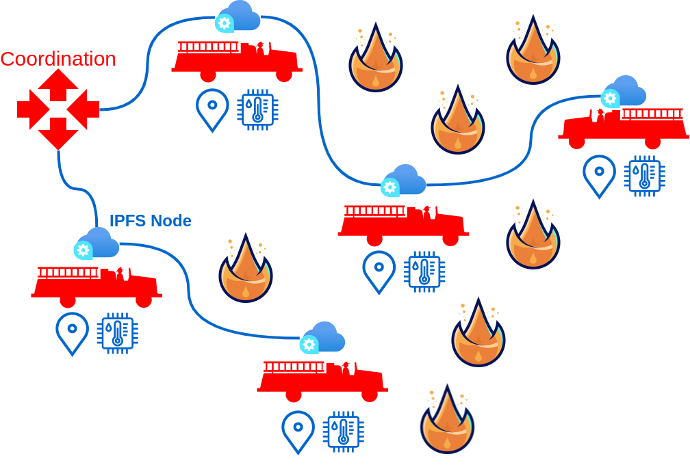

# Firemesh

### Project developed in the scope of the ***Autonomous System's Networks*** course, class of **2022-2023**, at the **University of Aveiro**.

___

# Motivation

Wild fires pose serious difficulties in terms of **coordination** and **communication**. Usually spanning for **large**, **remote**, geographical *areas*, and involving up to **hundred or even thousands of operatives** divided by multiple sectors and performing multitudes of different missions, coordinating operations in order to attain a successful outcome in the shortest amount of time possible can prove difficult.

These difficulties can present themselves in various manners, being the most obvious the **lack of situational awareness**, meaning the **reduced information** relative to the **status** of the operations and environment in **all of the affected area**. Also the **lack of communication infrastructures** in many of these remotes locations, severely limits the communication to **faulty or outdated** instruments like *SIRESP* and *VHF/UHF* radios.

# Applications and Use Case Scenarios

During operations, the commanding team responsible needs to be able to track the **evolution of the fire** through out the entire affected, and the **status of each team** in combat and in standby.

In this scenario, there is already a structure in place used to organize small and large groups of single teams, which can be composed of various types of machinery for different purposes.

For this application, we consider the smallest atomic team as a node in the system, being the most common node a combat team, which is composed by **one vehicle and five operatives**. Each one of this nodes can provide valuable information relative to the wild fire from their perspective, and could have capabilities of data collection, such as:
- **CO2, CO and humidity levels**,
- **Surrounding environment temperature**,
- **A 360 degree view of the location**,
- **Topographic data points like altitude, inclination, and atmospheric pressure**,
- **Meteorologic data points, like wind speed and direction**.

Besides collecting data relative to the fire, this could also become useful to observe and record aspects of each event in order to gather feedback and improve necessary aspects, such as safety. The nodes could also communicate with peers safety notices and warnings. Some aspects that can be subject of observation are:
- **Vehicle fuel and water levels**;
- **Health status of the operatives**;
- **Geolocation**;
- **Distress calls and danger alerts**;
- **Anchor points and escape routes**;

## Data Sharing

This data by itself has little to no used to each one of the teams, but when combined it offers a comprehensive readout of the event. To communicate this information effectively, we envision the use of **IPFS**. A network solution that **does not rely on an existing infrastructure** and at the same time can be quickly and easily deployed, being capapable of transmitting **large amounts of data**, **agnostic** to the **spacial disposition and number of intervenient**, and can be **easily arranged and re-arranged** in groups of intervenients (*clusters*) as to ease coordination, it is the ultimate goal for a network operating in these kinds of scenarios.

## Illustrative Diagram

This diagram roughly illustrated the communication between node, sharing information like humidity and temperature, as well as being able o reach distant using P2P technology.

  

